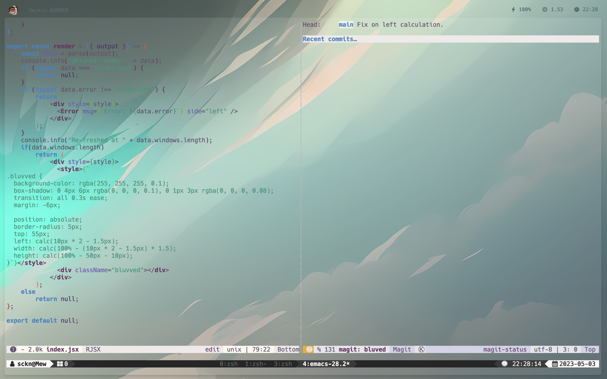

# [WeekEnd] BluevEd

Simple, yet, powerfull widget to cover your back. No, seriously, it covers your applications background.

## Showcase

### Usage screen-shots



## Installation

Clone this repo to your Übersicht widgets directory.

```bash
# assuming your widgets are in the default Übersicht location
$ git clone https://github.com/LeaveNhA/weekend-bluved.git $HOME/Library/Application\ Support/Übersicht/widgets/weekend-bluved
```

## Dependencies

There is no dependency for this widget.

## Usage

### Refreshing yabai workspaces widget

```shell
# Bluved update!
yabai -m signal --add event=display_changed \
    action="osascript -e 'tell application id \"tracesOf.Uebersicht\" to refresh widget id \"bluved-index-jsx\"'"
```
